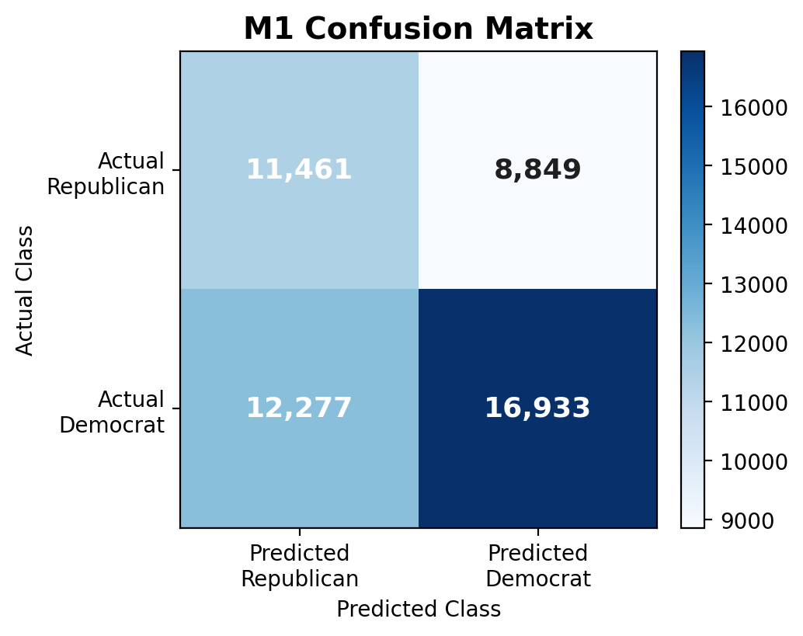
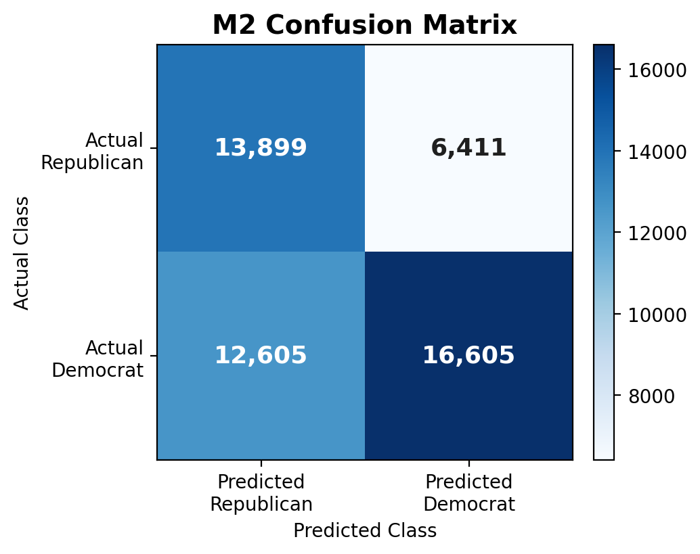

### Model Performance for M1 and M2

| Model | Accuracy | AUC |
|---|---:|---:|
| M1 | 0.573 | 0.602 |
| M2 | 0.616 | 0.678 |

#### M1 Confusion Matrix

{width=55%}

#### M2 Confusion Matrix

{width=55%}
